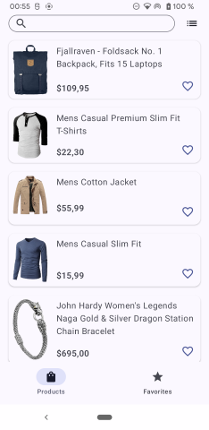
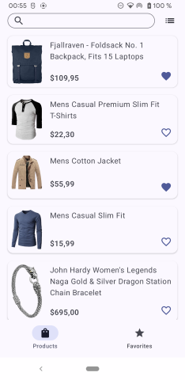
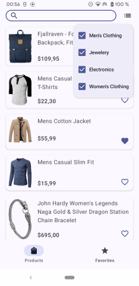
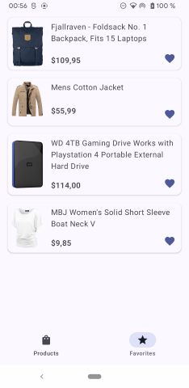
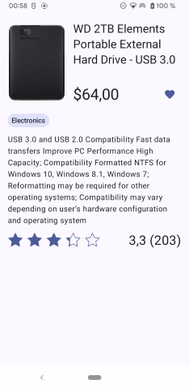
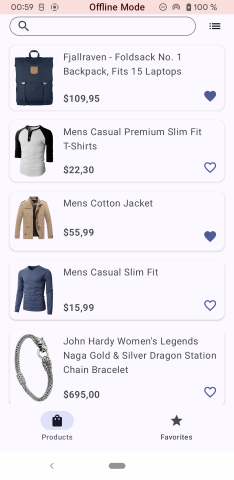
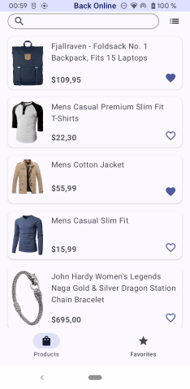
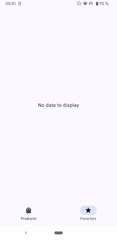
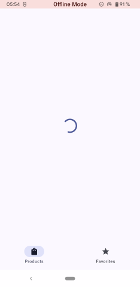

# Product App

## Overview
Product App is a client–server Android application that displays a list of products. Selecting an item opens a detailed product view containing description and rating information. Users can add or remove products from a favorites list, which is available on a dedicated screen. The product list supports filtering by name and/or category. The application correctly handles error states and empty data scenarios.

The data layer follows an Offline First approach. Local data remains accessible when remote synchronization is unavailable, ensuring consistent application behavior in offline conditions.

The project adheres to Clean Architecture principles. Core functionality is separated into feature modules, each organized into domain, data, and presentation layers. This structure enforces strict dependency boundaries and promotes component reusability.

## Project Structure

### `:app`
Application entry point. Initializes dependency injection, sets up navigation, and aggregates feature modules.

### `:core`
Core functionality shared across the application.

#### `:core:data`
Data layer base modules.

- `:core:data:persistence`  
  Local persistence implementation, including database entities, DAOs, and Room configuration.

- `:core:data:remote`  
  Remote data handling, including DTO definitions, Retrofit API interfaces, and network configuration.

#### `:core:domain`
Business logic layer containing domain entities, use cases, and repository interfaces. Shared across multiple features.

#### `:core:presentation`
Presentation base layer containing reusable UI abstractions, common view models, state containers, and utility components.

#### `:core:navigation`
Root navigation definitions and destination models used across modules.

### `:feature`
Feature-specific modules. Each feature is internally divided into domain, data, and presentation layers and can be included dynamically.

- `:feature:mainscreen`  
  Main screen implementation and navigation graph composition.

- `:feature:productlist`  
  Product list screen, including filtering logic and paging.

- `:feature:favorites`  
  Favorites list management and display.

- `:feature:productcard`  
  Detailed product description screen.

- `:feature:connectivity`  
  Network connectivity monitoring and UI indicator.

### `:build-logic`
Gradle convention plugins responsible for unified configuration across modules, build settings, dependency management, and code quality integration.

## Technical Stack
- Android SDK  
- Kotlin  
- Hilt (including Assist and AutoBind)  
- Room  
- Retrofit  
- WorkManager  
- Coroutines / Flow  
- Jetpack Compose  
- Compose Navigation  
- Material Design 3  
- Paging 3  
- Coil  
- MVVM  
- Clean Architecture  
- Gradle Multimodule  
- Detekt

## Media

